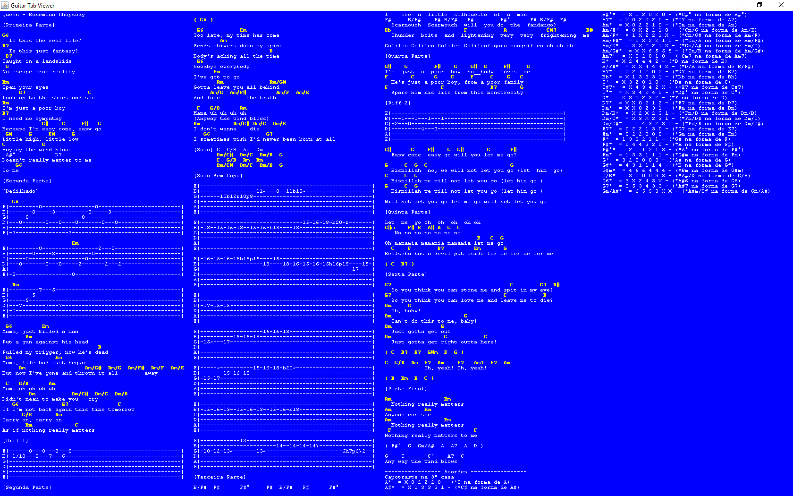

# CifraView
This app is used to view a guittar tab in a single screen without scrolling.

To run, open the cifraview.jar or from the command line run java -jar cifraview.jar 

Press CTRL+o to open a guittar tab in a text file. 
Press F1 to see other options. 
